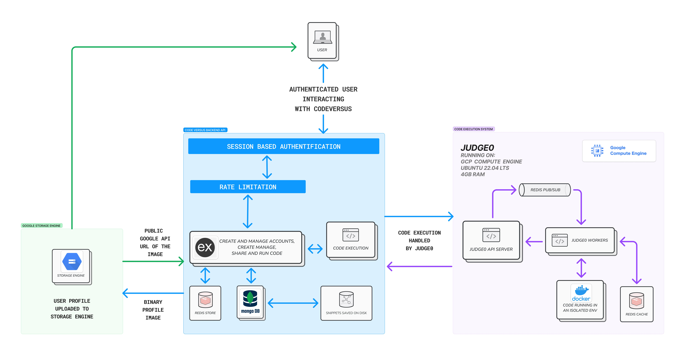

<h1 style="text-align: center;">⚔️ Code Versus</h1>



## Table of Content
- [Table of Content](#table-of-content)
- [Introduction](#introduction)
- [Technologies](#technologies)
- [Features](#features)
- [Usage](#usage)
- [Authors](#authors)

## Introduction
Code Versus is a powerful backend API for a collaborative coding platform, designed to support code execution, snippet management, and social interactions among developers.

## Technologies

### Backend
- Programming Language: Javascript
- Runtime: NodeJS
- Framework: ExpressJS
- Database: MongoDB
- ORM: Mongoose
- Data validation: Yup
- Session: Redis Storage
- File Upload: Google Cloud Storage
- Code Execution: Judge0 Running on Google Compute Engine
- Code quality: Eslint & Prettier

## Features

### Backend API

- [x] User Registration and session based Authentication
- [x] Email verification and Password reset
- [x] Rate limited code execution in multiple languages
- [x] Private and Public code snippets
- [x] Friendship system
- [x] Share private code snippets with friends
- [x] User and Code Snippet searching and filtering
- [x] User profile (avatar, friends, bio, interests etc.)


## Future Enhancements

- Integration with CodeMirror/MonacoEditor for code editing
- Real-time collaborative coding (Moonwalk feature)
- Battle mode for coding challenges
- Mock interview simulations

## Usage

To run the backend API in your local environment, follow the steps below:

1. Clone the repository
```bash
git clone https://github.com/fabeklou/codeVersus.git
```
2. Then go to the project directory and then to backend-api directory
```bash
cd codeVersus/backend-api
```
3. Now install the dependencies
```bash
npm install
```
4. Rename the `.env.example` file to `.env` and fill in the required environment variables

5. Start the server
```bash
# Development server with nodemon
npm run start:dev
# Production server
npm start
```
6. The server should be running on `http://localhost:5050`.
You can now test the API in the integrated Swagger UI documentation at `http://localhost:5050/api-docs`.
7. That is it! You can now start using the API.

## Authors

- Fabrice Eklou - Backend Developer :
    - [Linkedin](https://www.linkedin.com/in/fabeklou/)
    - [Github](https://github.com/fabeklou)
    - [Twitter](https://x.com/fabeklou)

---

Code Versus is currently in active development. Stay tuned for frontend implementation and additional features!
